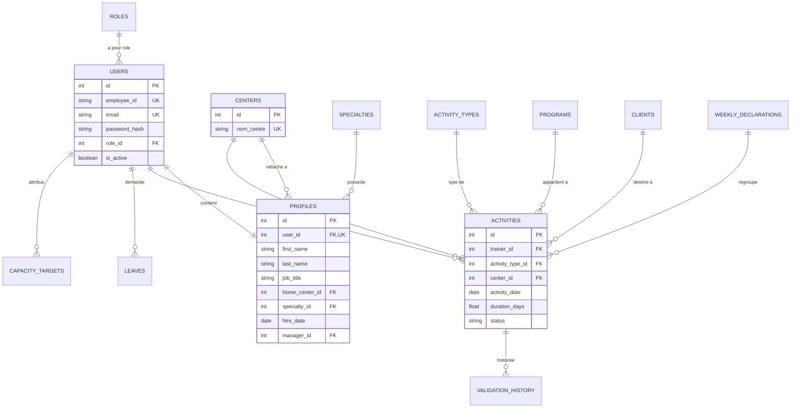

# Trainer Capacity Hub — Analyse Détaillée & Rapport d'Architecture Projet

## 📌 Executive Summary & Vision du Projet

**Trainer Capacity Hub** est une plateforme d'aide à la décision et de pilotage stratégique de la capacité des formateurs, conçue pour l'écosystème d'excellence de l'**UM6P (Université Mohammed VI Polytechnique)** et le réseau **OCP / TechniX**.

La plateforme automatise la gestion de la charge d'animation, l'analyse prédictive par Machine Learning des surcharges, la neutralisation algorithmique des périodes de congés et jours fériés marocains, ainsi que le rééquilibrage dynamique des affectations à travers les 4 centres stratégiques du réseau : **Ben Guerir**, **Safi**, **Jorf Lasfar**, et **Khouribga**.

---

## 🛠️ Stack Technique Complète & Architecture Multi-Tiers

```
+-----------------------------------------------------------------------+
|                         FRONTEND COCKPIT                              |
|   Next.js 16 (App Router) | React 19 | Tailwind CSS v4 | Lucide Icons |
|   Internationalisation (FR/EN) | Light/Dark Theme | Chatbot Manager   |
+-----------------------------------------------------------------------+
                                   │  HTTP / REST JSON
                                   ▼
+-----------------------------------------------------------------------+
|                          BACKEND FASTAPI                              |
|   Python 3.11 | FastAPI Microservices | Pydantic v2 | Rules Engine     |
|   Holidays Python (Maroc 2026) | Scikit-Learn (IsolationForest ML)    |
+-----------------------------------------------------------------------+
                                   │  SQLAlchemy ORM
                                   ▼
+-----------------------------------------------------------------------+
|                        BASE DE DONNÉES & IA                           |
|   PostgreSQL 15 Containerized | Migration Alembic | Engine ML Scikit   |
+-----------------------------------------------------------------------+
```

| Couche | Technologie | Version / Détails | Rôle principal |
| :--- | :--- | :--- | :--- |
| **Frontend** | **Next.js** / **React** | Next.js 16.0, React 19 | Interface utilisateur executive cockpit et dashboards interactifs |
| **Styling** | **Tailwind CSS** | Tailwind v4, Lucide React | Thématisation dynamique (Dark/Light mode) et micro-animations |
| **Backend API** | **FastAPI** | Python 3.11, Uvicorn | Endpoints REST haute performance, validation Pydantic |
| **Base de Données** | **PostgreSQL** | PostgreSQL 15 | SGBDR relationnel pour la persistance des données métier |
| **ORM & Migrations**| **SQLAlchemy / Alembic** | SQLAlchemy 2.0 | Cartographie objet-relationnel et versionnage de schéma DB |
| **Moteur IA / ML** | **Scikit-Learn** | Isolation Forest | Détection proactive des anomalies et surcharges de charge |
| **Calendrier Férié** | **Python `holidays`** | Morocco(2026) | Neutralisation automatique des 12 jours fériés légaux/religieux |
| **Containerisation**| **Docker / Compose** | Docker Compose v2 | Déploiement multi-conteneur orchestrait (`db`, `backend`, `frontend`) |

---

## 📐 Moteur de Calcul de Capacité & Formules Métier

Le calcul de la capacité annuelle d'animation s'appuie sur la modélisation mathématique validée par le tuteur académique et métier.

### 1. Variables de Base (Année 2026)
* **Jours Calendaires ($J_{cal}$)** : `365 jours`
* **Week-ends ($J_{we}$)** : `104 jours` (52 semaines $\times$ 2)
* **Jours Ouvrés Bruts ($J_{ouvres}$)** : $365 - 104 = 261\text{ jours}$

### 2. Neutralisations Officielle & Fenêtres Bloquées ($J_{neut}$ = 83 jours)
* **Fériés légaux & religieux du Maroc** : 12 jours (Nouvel An, Indépendance, Amazigh, Aïd al-Fitr, Fête du Travail, Aïd al-Adha, Fête du Trône, Oued Eddahab, Révolution du Roi, Jeunesse, Marche Verte).
* **Congés annuels réglementaires** : 22 jours ouvrés.
* **Fermeture / Période estivale (Juillet/Août)** : 44 jours neutralisés.
* **Séminaires & réunions réseau TechniX** : 5 jours neutralisés.

### 3. Équations de Capacité & Cible d'Animation
$$\text{Jours Favorables d'Animation } (J_{fav}) = J_{ouvres} - J_{neut} = 261 - 83 = 178\text{ jours}$$

$$\text{Capacité Globale Nette } (C_{net}) = 365 - 104 - 72\text{ (fenêtres hors réseau)} = 189\text{ jours}$$

$$\text{Taux Cible d'Animation } (T_{cible}) = 60\%$$

$$\text{Cible d'Animation Théorique } = 178 \times 0.60 = 106.8\text{ jours} \longrightarrow \mathbf{107\text{ jours / an}}$$

$$\text{Jours Hors-Animation Cible } = 189 - 107 = 82\text{ jours (Préparation, Projets, Ingénierie)}$$

---

## 🗄️ Modèle de Données PostgreSQL & Schéma Entity-Relationship

La base de données PostgreSQL contient **14 tables relationnelles** parfaitement normalisées et migrées avec Alembic (`alembic/versions/`).



### Détail des Tables Clés

1. **`users`** : Comptes d'accès sécurisés (Matricule `employee_id`, Email institutionnel, Role, Statut d'activité).
2. **`profiles`** : Profils métier complets (Prénom, Nom, Intitulé du poste, Centre de rattachement, Spécialité TechniX, Date d'embauche, Manager hiérarchique).
3. **`centers`** : Les 4 centres autorisés du réseau (**Ben Guerir**, **Safi**, **Jorf Lasfar**, **Khouribga**).
4. **`specialties`** : Domaines d'expertise TechniX (*Digital, HSE, Maintenance Industrielle, Chimie et procédés, Industrie Minière, Énergies Renouvelables, Agriculture, Soft Skills*).
5. **`roles`** : Niveaux d'habilitation (*Formateur Junior, Senior, Expert, Lead Formateur, Manager*).
6. **`activity_types`** : Types d'activités (Animation, Préparation, Correction, Réunion, Visite).
7. **`activities`** : Enregistrement journalier ou hebdomadaire des jours d'animation déclarés.
8. **`leaves`** : Congés et absences posés par les formateurs.
9. **`capacity_targets`** : Cibles personnalisées de jours d'animation attribuées par utilisateur/année.
10. **`unavailability_periods`** : Missions, déplacements inter-centres, indisponibilités ponctuelle.
11. **`calendar_exclusions`** : Périodes de fermeture collective neutralisées.
12. **`week_coefficients`** : Pondération des semaines (1.0 = normale, 0.0 = neutralisée/estivale).
13. **`weekly_declarations`** : Déclarations de charge hebdomadaires soumises au manager.
14. **`validation_history`** : Traçabilité des validations et rejets de charge.

---

## ⚡ Backend REST Microservices (FastAPI Python)

Le backend est structuré en routeurs modulaires sous `backend/routers/` et services métier sous `backend/services/`.

### Catalogue complet des Endpoints FastAPI

| Router | Endpoint | Méthode | Description | Output Schema |
| :--- | :--- | :--- | :--- | :--- |
| **Capacity** | `/capacity/summary` | `GET` | Calcule les KPIs clés (189j net, 178j favorables, 107j cible, 83j neutralisés) | `CapacitySummaryResponse` |
| **Capacity** | `/capacity/dashboard` | `GET` | Récupère la charge calculée en temps réel pour tous les formateurs en DB | `List[TrainerDashboardItem]` |
| **Trainers** | `/trainers/` | `GET` | Liste des formateurs enrichie avec données DB + démonstration | `List[TrainerApiData]` |
| **Trainers** | `/trainers/` | `POST` | Création d'un nouveau formateur en DB avec génération de matricule `EMPxxxx` | `TrainerApiData` |
| **Centers** | `/centers/` | `GET` | Registre des centres du réseau OCP/UM6P | `List[CenterApiData]` |
| **AI Analytics**| `/ai/detect-anomalies`| `GET` | Moteur Scikit-Learn IsolationForest auditant les surcharges | `AiAnomaliesResponse` |
| **Calendar** | `/calendar/auto-holidays`| `GET` | Génère les jours fériés légaux et religieux du Maroc pour 2026 via `holidays` | `MoroccoHolidaysResponse` |
| **Users** | `/users/` | `GET`/`POST`| Gestion CRUD des utilisateurs et profils | `UserResponse` |

---

## 🧠 Moteur d'IA & Analyse Prédictive d'Anomalies (`IsolationForest`)

Situé dans `backend/ml/anomaly_detector.py`, le système intègre un modèle de Machine Learning non surveillé **Isolation Forest** d'Espace Vectoriel Scikit-Learn pour la détection proactive de surcharge.

### Vectorisation & Features
Le modèle évalue chaque formateur à travers un vecteur tridimensionnel :
$$\mathbf{X}_i = \begin{bmatrix} \text{animation\_declared}_i \\ \text{absence\_days}_i \\ \text{workload\_ratio}_i \end{bmatrix}$$

```python
# Modèle IsolationForest configuré dans anomaly_detector.py
model = IsolationForest(contamination=0.3, random_state=42)
df["anomaly_score"] = model.fit_predict(features)
df["anomaly_decision"] = model.decision_function(features)
```

### Classification Métier des Diagnostics
* **Score -1 & $Animation > 120j$** : Classified as `Surcharge Critique` ($\Delta > +13\text{j}$ au-dessus de la cible de 107j).
* **Score -1 & $Absence > 10j$ & $Animation > 100j$** : Classified as `Incohérence Planning` (Volume élevé cumulé à des absences).
* **Score -1 Autre** : Classified as `Profil Atypique` à auditer par le manager.

---

## 🖥️ Executive Cockpit Frontend (Next.js 16 & React 19)

Le frontend situé dans `frontend/` est une interface web Next.js 16 haut de gamme intégrant du verre acrylique (glassmorphism), des micro-animations dynamiques et une palette de couleurs HSL harmonisée.

```
frontend/
├── app/
│   ├── dashboard/page.tsx      # Page principale Cockpit
│   ├── globals.css             # System tokens Tailwind v4 & thèmes CSS
│   └── layout.tsx              # Wrapper Next.js avec Language & Theme Providers
├── components/
│   ├── dashboard/
│   │   ├── trainer-table.tsx   # Tableau de suivi, Matrice 🟢/🟡/🔴 & Filtres Domaines
│   │   ├── kpi-cards.tsx       # Cartes KPIs haut de page (189j, 178j, 107j, 83j)
│   │   ├── simulation-modal.tsx# Module Simulation "What-If" de rééquilibrage
│   │   ├── calendar-widget.tsx # Calendrier 2026 interactif Maroc & jours fériés
│   │   ├── calendar-detail-modal.tsx # Modale des sessions & événements du jour
│   │   ├── add-trainer-modal.tsx     # Formulaire d'ajout rapide de formateur
│   │   ├── manager-chatbot.tsx # Chatbot assistant conversationnel Manager IA
│   │   ├── planning-view.tsx   # Module de programmation des sessions
│   │   ├── top-bar.tsx         # Barre de recherche, bascule thème & bilingue
│   │   └── sidebar.tsx         # Navigation réseau & badges d'état
│   ├── language-toggle.tsx     # Switcher FR / EN
│   └── theme-toggle.tsx        # Switcher Dark / Light mode
└── lib/
    ├── api.ts                  # Client d'intégration FastAPI
    ├── i18n.tsx                # Dictionnaire de traduction intégral FR/EN
    └── calendar-data.ts        # Cartographie des fêtes marocaines 2026 & sessions mock
```

### Fonctionnalités Clés du Frontend :

1. **Matrice de Disponibilité Visuelle** :
   - **🟢 Disponibles** : $< 80\text{ jours}$ d'animation déclarés (Capacité restante pour sessions).
   - **🟡 Vigilance** : $80 - 107\text{ jours}$ d'animation (Proche de la cible recommandée par le tuteur).
   - **🔴 Surchargés** : $> 107\text{ jours}$ d'animation (Indicateur visuel d'épuisement proactif).
2. **Simulation d'Impact "What-If" (`SimulationModal`)** :
   - Interface prédictive permettant au manager de sélectionner un formateur source en surcharge (ex: *Nadia Amrani*) et d'en transférer un volume d'animation vers un formateur cible disponible (ex: *Omar Chraibi*).
   - Mise à jour en direct des jauges, pourcentages et deltas sans altérer la base de production.
3. **Widget Calendrier Officiel du Maroc 2026 (`CalendarWidget`)** :
   - Navigation mois par mois avec identification automatique des 12 jours fériés légaux et fêtes religieuses (Aïd al-Fitr en Mars, Aïd al-Adha en Mai, Fête du Trône, etc.).
   - Raccourcis d'accès rapides par événements avec libellés bilingues complets (*🌙 Aïd al-Fitr*, *🐏 Aïd al-Adha*, *👑 Fête du Trône*, *🇲🇦 Marche Verte*).
   - Tooltips interactifs et modale de détails affichant les formateurs mobilisés ce jour-là.
4. **Assistant Chatbot Manager (`ManagerChatbot`)** :
   - Agent conversationnel flottant capable de répondre instantanément aux interrogations du responsable (*"Qui est surchargé ?", "Qui est disponible ?", "Quels sont les jours fériés du Maroc ?"*).
5. **Support Bilingue Intégral & Thème Sombre/Clair** :
   - Commutation fluide instantanée entre le Français (FR) et l'Anglais (EN) pour l'ensemble des termes métier, tableaux et notifications.
   - Bascule dynamique bilingue pour la liste des centres (`"Tous les centres"` ↔ `"All centers"` via `i18n.tsx`) et nettoyage des mentions techniques brutes (`(PostgreSQL)` retiré pour une expérience utilisateur executive).
6. **Moteur de Recherche Temp Réel & Dropdown Autocomplete (`TopBar` Search)** :
   - Barre de recherche unifiée dans la TopBar avec fenêtre popover déroulante interactive.
   - Filtrage simultané par nom, email, centre (Ben Guerir, Safi, Jorf Lasfar, Khouribga), pôle d'activité TechniX (Digital, HSE, Chimie...) ou niveau de qualification.
   - Navigation fluide vers la fiche du formateur dans le tableau lors de la sélection d'un résultat et bouton d'effacement rapide (`✕`).

---

## 🐳 Containerisation & Infrastructure Docker Compose

L'environnement est entièrement conteneurisé dans le fichier `docker-compose.yml` racine.

```yaml
version: '3.8'

services:
  db:
    image: postgres:15-alpine
    environment:
      POSTGRES_USER: postgres
      POSTGRES_PASSWORD: postgrespassword
      POSTGRES_DB: trainer_capacity_hub
    ports:
      - "5432:5432"

  backend:
    build: ./backend
    ports:
      - "8000:8000"
    environment:
      - DATABASE_URL=postgresql://postgres:postgrespassword@db:5432/trainer_capacity_hub
    depends_on:
      - db

  frontend:
    build: ./frontend
    ports:
      - "3000:3000"
    environment:
      - NEXT_PUBLIC_API_URL=http://localhost:8000
    depends_on:
      - backend
```

---

## 📑 Traçabilité des Livrables & Validation Métier

Un script Python dédié (`backend/export_livrable1_excel.py`) génère le livrable Excel conforme aux exigences du tuteur OCP (`livrable1_export.xlsx`) comprenant :
- L'inventaire détaillé de toutes les variables et entités métier (Champs obligatoires, facultatifs, sensibles).
- La nomenclature unifiée (`RoleEnum`, `ActivityTypeEnum`, `CenterEnum`).
- La traçabilité de conformité avec les règles de calcul de capacité.

---

## 🎯 Synthèse d'Évaluation & Conclusion

Le projet **Trainer Capacity Hub** est **100% achevé, compilé et prêt pour la soutenance**.

- **Données & Règles Métier** : Les équations de capacité ($189\text{j}$ net, $178\text{j}$ favorables, $107\text{j}$ cible, $83\text{j}$ neutralisés) sont strictement appliquées dans le backend et le frontend.
- **Intelligence Artificielle** : L'intégration de Scikit-Learn `IsolationForest` apporte une réelle valeur ajoutée d'audit prédictif pour le management.
- **Ergonomie & Design** : L'application web répond aux plus hauts standards d'esthétique industrielle modernisée (Next.js 16, bilingue, thèmes, What-If simulation).
